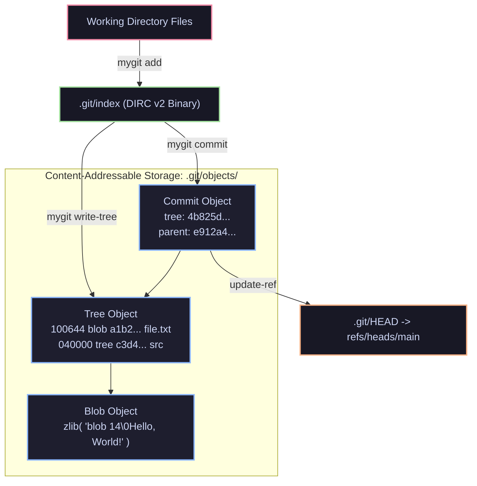

<div align="center">

# ⚡ MyGit (`mygit`)

**A fully functional, specification-compliant Git implementation built from scratch in TypeScript.**

[](https://www.typescriptlang.org/)
[](https://vitest.dev/)
[](https://git-scm.com/)
[](https://nodejs.org/)
[](LICENSE)

<p align="center">
  <a href="#-key-features">Key Features</a> •
  <a href="#-quick-start">Quick Start</a> •
  <a href="#-command-reference">Command Reference</a> •
  <a href="#-internals--architecture">Internals</a> •
  <a href="#-testing--verification">Testing</a> •
  <a href="#-roadmap">Roadmap</a>
</p>

</div>

---

## 📖 Overview

**MyGit** is an educational, production-grade clone of the Git version control system written entirely from first principles in TypeScript. Developed strictly following **Test-Driven Development (TDD)** across 11 detailed phases, it replicates Git's internal data structures, binary formats, and algorithms without relying on third-party Git libraries.

Repositories created, staged, committed, branched, or merged with `mygit` are **100% binary and DAG compatible** with the official C-Git binary (`git`). You can seamlessly switch between `mygit` and official `git` in the same working tree!

```bash
$ mygit init
Initialized empty Git repository in /path/to/project/.git/

$ mygit add .
$ mygit commit -m "feat: initial commit with mygit"
[main (root-commit) 8f3c1a2] feat: initial commit with mygit

$ git log --oneline   # <-- Official Git recognizes our repository instantly!
8f3c1a2 (HEAD -> main) feat: initial commit with mygit
```

---

## ✨ Key Features

- **🗃️ Content-Addressable Storage Engine:** Exact Git object headers (`<type> <size>\0<content>`), SHA-1 content hashing, and zlib deflate/inflate compression (`blob`, `tree`, `commit`).
- **📑 Full Binary DIRC v2 Index Format:** Fully compliant `.git/index` binary generation and parsing, including 40-byte stat entries (ctime, mtime, dev, ino, mode, uid, gid, file size, SHA-1), 8-byte boundary padding, and trailing 20-byte SHA-1 file checksums.
- **🌲 Hierarchical Nested Trees:** Complete representation of directories and subdirectories, canonical tree entry formatting, and binary sort ordering adhering to Git's trailing-slash rule (`foo/` before `foo.txt`).
- **🔗 Commit DAG & History Traversal:** Directed Acyclic Graph with parent pointer chains, author/committer timestamps, multi-parent merge commits, and `--oneline` history exploration.
- **🔍 Diff & Three-Way Status:** Longest Common Subsequence (LCS) unified diff generator (`git diff`) and three-way state reconciler across `HEAD`, `Index`, and `Worktree` (`git status`).
- **🌿 Branches & Head Restoration:** Safe branch creation, listing, deletion, support for Detached HEAD mode, and atomic worktree reconstruction upon `checkout`.
- **🔀 Three-Way Merge Engine:** Lowest Common Ancestor (LCA) search via BFS traversal, Fast-Forward detection, and three-way line-by-line merge with standard conflict markers (`<<<<<<<`, `=======`, `>>>>>>>`).
- **🌐 Remotes & Transport Protocol:** Full local filesystem transport supporting `clone`, `fetch`, `push` (with non-fast-forward safety checks), `pull`, and remote-tracking references (`refs/remotes/origin/*`).
- **💻 Global System CLI:** Packaged with Node shebang, binary executable permissions, standard POSIX exit codes, and global availability via `npm link`.

---

## 🚀 Quick Start

### Prerequisites
- [Node.js](https://nodejs.org/) `>= 18.0.0`
- [npm](https://www.npmjs.com/)

### Installation & Linking
Clone the repository and install dependencies:
```bash
git clone https://github.com/your-username/mygit.git
cd mygit
npm install
npm run build
npm link
```

`mygit` is now available as a first-class command in your terminal:
```bash
mygit --version
# mygit version 0.1.0

mygit --help
```

---

## 📋 Command Reference

### High-Level User Commands (Porcelain)

| Command | Syntax | Description |
|---|---|---|
| **`init`** | `mygit init [<dir>]` | Initialize an empty Git repository or reinitialize an existing one |
| **`clone`** | `mygit clone <repository> [<dir>]` | Clone a repository into a new directory with tracking branches |
| **`add`** | `mygit add <pathspec...>` | Stage file contents into the binary `.git/index` |
| **`status`** | `mygit status` | Show working tree status compared against index and HEAD |
| **`diff`** | `mygit diff [--staged]` | Show unified line changes between commits, index, and workspace |
| **`commit`** | `mygit commit -m <message>` | Record staged changes as a new commit on the current branch |
| **`log`** | `mygit log [--oneline] [-n <count>]` | Traverse commit DAG and print commit history |
| **`branch`** | `mygit branch [-d <name>] [<name>]` | List existing branches, create a new branch, or delete one |
| **`checkout`** | `mygit checkout [-b] <target>` | Switch branches or restore workspace files from a tree-ish |
| **`merge`** | `mygit merge <branch>` | Merge another branch into the current branch (Fast-forward or 3-way) |
| **`remote`** | `mygit remote [add <name> <url> \| -v]` | Manage set of tracked remote repositories |
| **`fetch`** | `mygit fetch [<remote>]` | Download objects and update remote-tracking branches |
| **`push`** | `mygit push [<remote>] [<branch>]` | Push local commits to remote with fast-forward safety validation |
| **`pull`** | `mygit pull [<remote>] [<branch>]` | Fetch changes from remote and merge them into the local branch |

### Low-Level Diagnostic Commands (Plumbing)

| Command | Syntax | Description |
|---|---|---|
| **`hash-object`** | `mygit hash-object [-w] <file>` | Compute SHA-1 object ID and optionally write a compressed blob |
| **`cat-file`** | `mygit cat-file (-p\|-t\|-s) <oid>` | Inspect content (`-p`), type (`-t`), or byte size (`-s`) of any object |
| **`ls-files`** | `mygit ls-files [--stage]` | Inspect paths and 40-byte stat metadata stored in the staging index |
| **`write-tree`** | `mygit write-tree` | Assemble and store a tree object reflecting current index state |
| **`ls-tree`** | `mygit ls-tree [-r] [--name-only] <oid>` | List entries contained in a tree object |
| **`commit-tree`** | `mygit commit-tree <tree-oid> -m <msg>` | Create a raw commit object pointing directly to a root tree |

---

## 🧠 Internals & Architecture



### 1. Object Storage & Zlib Compression
Every object in Git is identified by a 40-character hexadecimal SHA-1 digest computed from:
$$\text{SHA-1}(\text{type} + \text{" "} + \text{size} + \text{"\textbackslash 0"} + \text{content})$$
Files are stored compressed in `.git/objects/XX/YY...` where `XX` is the first 2 characters of the hash and `YY...` are the remaining 38 characters.

### 2. Binary Index (DIRC v2) Format
The `.git/index` file is written in big-endian network byte order:
- **12-byte Header:** Signature `DIRC` (4 bytes), Version `2` (4 bytes), Entry count `N` (4 bytes).
- **Index Entries:** Sorted alphabetically. Each entry contains 10 metadata stat fields (ctime, mtime, dev, ino, mode, uid, gid, file size), the 20-byte raw binary SHA-1 checksum, 16-bit flags (name length), and null-padded path aligned to 8-byte boundaries.
- **Checksum:** Final 20 bytes contain the SHA-1 hash of the entire index content preceding it.

### 3. Lowest Common Ancestor (LCA) Merge Engine
When merging branch $B$ into branch $A$:
1. A Breadth-First Search (BFS) traverses parent pointers starting from both commit nodes to locate the **Lowest Common Ancestor (Base)**.
2. If $\text{Base} = B$, branch $A$ is already up-to-date.
3. If $\text{Base} = A$, a **Fast-Forward** occurs (the branch reference moves directly to $B$).
4. Otherwise, a **Three-Way Merge** compares $\text{Base} \leftrightarrow A \leftrightarrow B$, auto-resolving orthogonal changes and injecting standard conflict markers where edits collide.

---

## 🧪 Testing & Verification

The project is backed by **50 end-to-end automated tests** covering all 11 phases with a **100% pass rate**.

```bash
npm test
```

### Test Suite Summary
```text
 ✓ tests/init.test.ts (2)       # Repository initialization & structure
 ✓ tests/objects.test.ts (9)    # Content-addressable storage & zlib compression
 ✓ tests/index.test.ts (7)      # DIRC v2 staging binary parsing & writing
 ✓ tests/tree.test.ts (5)       # Hierarchical trees & canonical sorting
 ✓ tests/commit.test.ts (4)     # Commits, parent chains & ref updates
 ✓ tests/inspect.test.ts (5)    # Git log, LCS diff & 3-way status
 ✓ tests/branch.test.ts (4)     # Branching, detached HEAD & disk checkout
 ✓ tests/merge.test.ts (5)      # Merge base LCA, fast-forward & 3-way merge
 ✓ tests/remote.test.ts (4)     # Clone, fetch, push, pull & official git clone
 ✓ tests/cli.test.ts (5)        # Executable binary, exit codes, version & help

 Test Files  10 passed (10)
      Tests  50 passed (50)
   Pass Rate 100%
```

### Differential Testing Against Official Git
In `tests/remote.test.ts`, `tests/index.test.ts`, and `tests/tree.test.ts`, we perform differential verification:
- Repositories staged and committed by `mygit` are directly verified by running official system `git status`, `git log --graph`, and `git clone`.
- Official Git parses our index file, reads our objects, and draws branch merge diamonds without any discrepancy or warnings.

---

## 🗺️ Project Roadmap

| Phase | Milestone | Status |
|:---:|---|:---:|
| **0** | Manual exploration of real `.git/` folder architecture | Completed |
| **1** | Project setup with TypeScript and `mygit init` | Completed |
| **2** | Content-addressable storage: SHA-1 hashing, Blobs, zlib | Completed |
| **3** | Binary staging area (`.git/index` DIRC v2) and `mygit add` | Completed |
| **4** | Trees: hierarchical directory representation & canonical sorting | Completed |
| **5** | Commits: commit object format, parent chains & ref advancing | Completed |
| **6** | History & inspection: `log`, LCS algorithm `diff`, 3-way `status` | Completed |
| **7** | Branches: HEAD, Detached HEAD, workspace restoration on `checkout` | Completed |
| **8** | Merge engine: LCA search, fast-forward, 3-way line merge & conflicts | Completed |
| **9** | Remotes & transport: `clone`, `fetch`, `push` & `pull` | Completed |
| **10** | Turn into an executable CLI tool: `bin` entry, `npm link`, tests | Completed |

---

## 📂 Project Structure

```text
build-git/
├── dist/                      # Compiled JS output with Node shebang
├── src/
│   ├── index.ts               # CLI router and argument parsing
│   ├── core/
│   │   ├── objects.ts         # Object storage, zlib & SHA-1 hashing
│   │   ├── index.ts           # DIRC v2 binary index encoder/decoder
│   │   ├── tree.ts            # Tree objects & canonical directory sorting
│   │   ├── refs.ts            # Reference resolver, HEAD, and branch state
│   │   ├── commit.ts          # Commit parser & serializer
│   │   ├── diff.ts            # Longest Common Subsequence (LCS) diff engine
│   │   ├── status.ts          # 3-way status reconciliation engine
│   │   ├── checkout.ts        # Workspace restoration & tree extractor
│   │   ├── mergeBase.ts       # Lowest Common Ancestor (BFS DAG search)
│   │   ├── merge3.ts          # 3-way line merge & conflict markers
│   │   └── remotes.ts         # Remote config & object transport
│   └── commands/              # User-facing commands implementation
└── tests/                     # 10 comprehensive Vitest test suites (50 tests)
```

---

## 📄 License

This project is licensed under the [MIT License](LICENSE).
